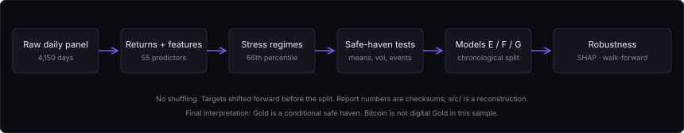

<p align="center">
  
</p>

# Macro Asset Stress Modeling

**When markets get stressed, does Gold actually protect you — and does Bitcoin behave anything like it?**

We asked that as a CompSci 390B group research project (Spring 2026) on 4,150 daily observations of Gold, U.S. equities (SPY), and Bitcoin, paired with VIX, high-yield spreads, and a financial stress index.

The short answer: **Gold is a conditional safe haven**, not a universal one. The evidence is strongest under volatility-driven stress and the COVID-style liquidity shock. It is weaker under the 2022 inflation/rate shock. Bitcoin fails the same tests — it does not earn the "digital gold" label in this sample.

I worked on model design, training, evaluation, and the comparison across logistic regression, Ridge, XGBoost, LightGBM, CatBoost, Random Forest, MLP, and stacking. Dhruv Kartik implemented the empirical pipeline (regimes, event studies, SHAP, walk-forward). Nathan Dennis led the written report structure. The group shared the research questions and the interpretation.

This repository is the **September 2026 recovery**: original notebooks were not available to package, so the runnable code reconstructs the published methodology. The May 2026 report remains the scholarly record. See [docs/RECOVERY_NOTES.md](docs/RECOVERY_NOTES.md).

---

## Why this project

A safe haven isn't an asset with a good average return. It's an asset that defends *exactly when* risky assets are under pressure. That is a risk-management question, not a "which ticker went up" question.

We wanted to know whether common macro-stress proxies actually pick out those episodes, whether Gold's reputation shows up in the daily data, and whether Bitcoin behaves like Gold or like a high-beta risk asset.

## Research questions

1. Are volatility and market-risk measures systematically higher during macro-financial stress?
2. Does Gold behave defensively relative to SPY during stress — and is that robust to how you define "stress"?
3. Does Bitcoin behave like Gold under the same definitions, or like a high-beta risk asset?
4. Can lagged macro-financial indicators improve forecasting beyond simple baselines?

## What I contributed

In this project I focused on **model design, training, evaluation, and comparisons**. I helped set up the families we actually ran — logistic / Ridge baselines against XGBoost, LightGBM, CatBoost, Random Forest, MLP, and stacking — and I used the resulting metrics to argue that "best model" depends on the target.

I did **not** write the original empirical pipeline. Dhruv built regime construction, the conditional return/volatility tests, event studies, SHAP, threshold robustness, and walk-forward. I am packaging this repository after the course workspace was lost.

## Dataset

Kaggle: *Algorithmic Trading: Macro Stress & Asset Regimes* (Kanchana1990). **4,150 daily observations, 2014-10-17 through 2026-02-25.** The CSV is **not** in git (CC BY-NC-SA 4.0). Acquisition: [data/README.md](data/README.md). Schema: [data/data_schema.csv](data/data_schema.csv).

- **Assets:** Gold, `Equities_US` (SPY), Bitcoin — daily log returns \(r_t = \log P_t - \log P_{t-1}\).
- **Macro / state:** VIX, high-yield spread, financial stress index, yield-curve spread, 90-day stock–bond correlation, SPY drawdown, RSI, 30-day rolling volatility.

The public extract can keep growing. The code always restricts to the historical project window.

## How the project evolved

Proposal → EDA → Milestone 1 baselines → regime analysis → nonlinear models → robustness → conclusions. Full chronology: [docs/PROJECT_TIMELINE.md](docs/PROJECT_TIMELINE.md).

The important turn was Milestone 1. Next-day Gold returns were close to unforecastable (Ridge RMSE 0.010764, no better than a zero baseline). SPY 30-day volatility at h=5 was not: persistence RMSE ~0.0248, Ridge RMSE ~0.0210, Ridge R² ~0.9046 later. That pushed us off "predict Gold tomorrow" and onto "when does Gold actually defend, and under what kind of stress?"

## Methodology

<p align="center">
  
</p>

Chronological splits only. Targets are shifted forward before the cut. Details: [docs/METHODOLOGY.md](docs/METHODOLOGY.md).

Baseline stress flags use the **66th percentile** so we isolate elevated stress without emptying the sample.

| Regime | Rule | Share of days |
|---|---|---|
| `stress_hys` | High-yield spread ≥ 4.400 | 34.2% |
| `stress_fsi` | Financial stress index ≥ −0.172 | 34.1% |
| `stress_vix` | VIX ≥ 19.060 | 34.0% |
| `stress_any` | At least one flag | 56.3% |
| `stress_all` | All three flags | 14.3% |

## Main empirical findings

Full tables: [docs/RESULTS.md](docs/RESULTS.md). These are **published report numbers**.

**Gold's safe-haven status is real but conditional.** Under VIX stress, Gold's mean daily log return is +0.00068 while SPY's is −0.00092 — the spread widens by 0.00247 with a bootstrap CI excluding zero (`stress_any` +0.00096; `stress_all` +0.00191). The same test under financial-stress-index regimes shows *no* Gold advantage (−0.00012). In the 2022 inflation/rate-hike window Gold lost more than SPY.

The VIX result survives 66th, 75th, and 90th percentile cuts. `stress_any` does not survive the 90th. Spearman ρ between VIX intensity and the Gold–SPY spread is +0.0859 (p < 0.001); HYS and FSI do not tell the same story.

**Bitcoin is not digital gold in this sample.** Gold's beta to SPY *falls* from +0.157 in calm periods to +0.020 during stress. Bitcoin's moves the other way: +0.666 → +0.862. Bitcoin's 30-day volatility sits near 0.61 in *both* regimes (p = 0.859). Its worst days overlap SPY's worst days more than Gold's do (16.3% vs 13.5%).

**Stress expands equity volatility more than Gold's.** Under `stress_any`, Gold 30d vol 0.1040 → 0.1298 (+24.8%); SPY 0.0853 → 0.1521 (+78.3%). Bitcoin is simply always volatile.

## Modeling

Three supervised tasks. No shuffling.

- **Model E** — does Gold beat SPY tomorrow? 55 predictors. Train 2014-11-21 → 2023-11-25, test 2023-11-26 → 2026-02-24 (822 rows; Gold beats SPY on 38.3% of them).
- **Model F** — 30-day rolling volatility for SPY, Bitcoin, and VIX at h = 1 and 5: persistence vs Ridge vs XGBoost.
- **Model G** — `stress_any` five trading days ahead. Headline metric: PR–AUC, because the original high-yield-stress target had a ~0.7% test positive rate.

### Model E (published)

| Model | Accuracy | Bal. acc | F1 | ROC–AUC |
|---|---:|---:|---:|---:|
| Majority | — | — | — | 0.5000 |
| VIX rule | — | — | — | 0.5040 |
| Logistic | — | — | — | 0.6091 |
| MLP | — | — | — | 0.5673 |
| Random Forest | — | **0.6467** | **0.5833** | 0.6622 |
| LightGBM | — | — | — | 0.6687 |
| CatBoost | — | 0.6179 | — | 0.6722 |
| Stacking | — | — | — | 0.6800 |
| **XGBoost** | **0.6460** | 0.5922 | 0.4393 | **0.6835** |

XGBoost is best by ranking. Random Forest is best on balanced classification metrics. I do not treat those as the same claim.

Walk-forward (expanding yearly tests 2019–2026): mean ROC–AUC **0.6571** (σ = 0.0289); all eight folds > 0.55. That is not one lucky 80/20 split.

Themed SHAP: cross-asset momentum 39.5%, macro stress 20.0%, RSI 17.3%, volatility 14.3%, other 9.0%. Model E is a **momentum + stress** classifier, not a pure macro-stress model.

### Model F (published) — complexity is not free

| Target | Persistence RMSE | Ridge RMSE | XGBoost RMSE |
|---|---:|---:|---:|
| SPY 30d vol, h=1 | 0.0099 | **0.0097** | 0.0164 |
| SPY 30d vol, h=5 | 0.0248 | **0.0210** | 0.0246 |
| BTC 30d vol, h=5 | **0.0608** | 0.0612 | 0.0755 |
| VIX, h=5 | **3.2783** | 3.2904 | 5.5236 |

XGBoost's VIX h=5 R² is **−0.4337**. Persistent volatility rewards persistence and Ridge.

### Model G (published) — PR–AUC on `stress_any` at h=5

| Model | PR–AUC |
|---|---:|
| Majority | 0.2433 |
| Persistence | 0.5240 |
| **Logistic (balanced)** | **0.7095** |
| XGBoost (default / weighted / SMOTE / tuned threshold) | 0.6429–0.6518 |

Logistic wins. Threshold tuning helped validation and generalized poorly.

## What failed, and what I took from it

**The MLP failed instructively.** ~100% train accuracy, ~53% test accuracy. Seven of its top-ten important features fail a KS train/test test (p < 0.01). Heavier regularization fixed calibration (Brier 0.44 → 0.24) but not ranking (ROC–AUC stayed ≈ 0.51). That is covariate shift, not just overfitting.

**XGBoost lost to persistence on sticky volatility.** I helped evaluate that comparison; I am not going to hide it. Matching model class to the target mattered more than stacking another booster.

**Milestone 1 Gold-return Ridge did not beat a zero baseline.** That negative result is why the project changed direction.

## Figures (from the original report)

<table>
<tr>
<td width="50%"></td>
<td width="50%"></td>
</tr>
<tr>
<td><b>Stress windows.</b> Gold protects capital most clearly in the COVID crash, is weak in the 2022 inflation/rate shock, and is positive but not dominant in 2023 banking stress.</td>
<td><b>Volatility by regime.</b> Gold's volatility rises in stress but stays far below Bitcoin's and expands much less than SPY's. Bitcoin is simply always volatile.</td>
</tr>
<tr>
<td></td>
<td></td>
</tr>
<tr>
<td><b>Model E ranking.</b> Nonlinear models improve the Gold-vs-SPY ranking task; XGBoost leads by ROC–AUC.</td>
<td><b>What drives it.</b> Most of XGBoost's signal comes from lagged cross-asset returns, not the stress indicators themselves.</td>
</tr>
</table>

## Limitations

These are part of the result.

- **Regime sensitivity.** VIX-based stress produces the robust safe-haven result; HYS and FSI stress do not.
- **Full-sample threshold bias.** Descriptive quantiles use the whole sample — fine retrospectively, leaky in a live system.
- **Covariate shift.** The MLP failure is direct evidence. Walk-forward helps; it does not eliminate regime drift.
- **Event-window selection.** Economically meaningful windows; different dates change cumulative returns.
- **U.S.-centric sample starting 2014.** Enough for modern Bitcoin, not enough for Gold across many historical cycles. No costs, spreads, taxes, or portfolio constraints.
- **Multiple testing.** Many regimes, thresholds, horizons, and models.
- **Lost original notebooks.** Exact hyperparameters were not fully preserved. The report is the source of truth for published numbers.

## Reproduce

```bash
make setup          # python 3.13 venv + package (macOS: also installs libomp for XGBoost)
make test           # leakage / transform invariants (no Kaggle CSV required)
make download       # needs ~/.kaggle/kaggle.json — or follow data/README.md
make data-check     # 4,150 rows, dates, required columns
make reproduce      # features, Model E/F/G, walk-forward, figures
```

`make reproduce` writes `results/latest/run.json` and `results/latest/DISCREPANCY.md`. Published scores (XGBoost ROC–AUC **0.6835**, Model G logistic PR–AUC **0.7095**) are **checksums**. The reconstruction uses library defaults where original hyperparameters were not recovered. It is not tuned to hit those numbers.

More: [docs/REPRODUCIBILITY.md](docs/REPRODUCIBILITY.md).

## Repository

```
├── src/macro_stress/     reconstructed analysis (not original notebooks)
├── scripts/              download_data.py, reproduce.py
├── notebooks/            reconstructed walkthrough
├── tests/                leakage / split / sample-window invariants
├── data/                 schema + download instructions (CSV not committed)
├── figures/              published report figures
├── report/               final course report (May 2026)
├── presentation/         8-minute results deck + original course slides
├── results/historical/   published checksums
└── docs/                 methodology, results, recovery, timeline
```

## Report and presentation

- Report: [Algorithmic Prediction of Trade and Value of Monetary and Currency-Based Assets](report/Macro_Asset_Volatility_Modeling.pdf) (May 2026)
- Results deck (~8 min): [presentation/final_presentation.pptx](presentation/final_presentation.pptx) · [speaker notes](presentation/speaker_notes.md)
- Original course slides (12 slides, pre-walk-forward framing): [presentation/course-final-presentation.pptx](presentation/course-final-presentation.pptx)

## Who did what

Group project. The boundaries matter.

- **Dhruv Kartik** implemented the empirical pipeline: regime construction, conditional return/volatility analysis, event studies, nonlinear modeling, SHAP, threshold robustness, and walk-forward validation.
- **Sebastian Vaskes Pimentel** contributed to model design, training, evaluation, and the comparison across Logistic Regression, Ridge, XGBoost, LightGBM, CatBoost, Random Forest, MLP, and stacking.
- **Nathan Dennis** led much of the written report structure and integration.
- We collaborated on the research questions, feature choices, safe-haven interpretation, limitations, and conclusions.

**Repository recovery / reproducibility packaging:** Sebastian Vaskes Pimentel, September 2026.

The code in `src/` is reconstructed from the surviving report, dataset, and published metrics. It is not a claim that I wrote the original notebooks.

## Data license

Kaggle dataset remains CC BY-NC-SA 4.0 on Kaggle. See [docs/DATA_LICENSE_AND_PROVENANCE.md](docs/DATA_LICENSE_AND_PROVENANCE.md). No license file is attached to the reconstruction; the course report is the scholarly record.
