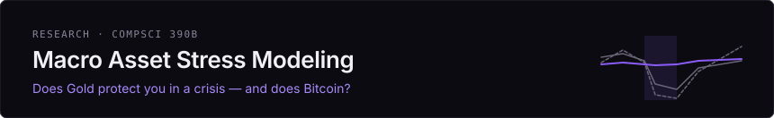
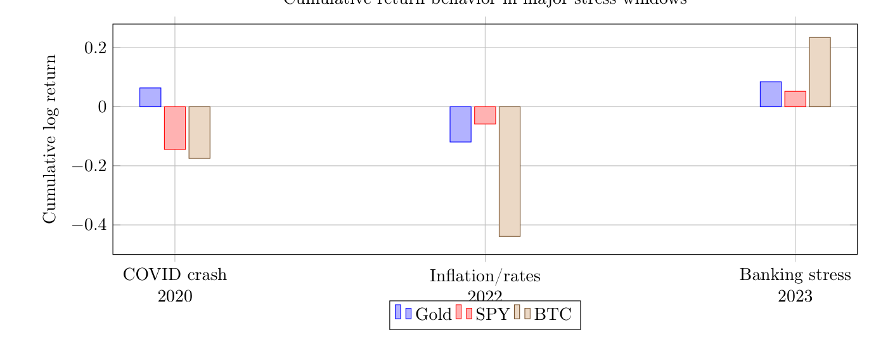
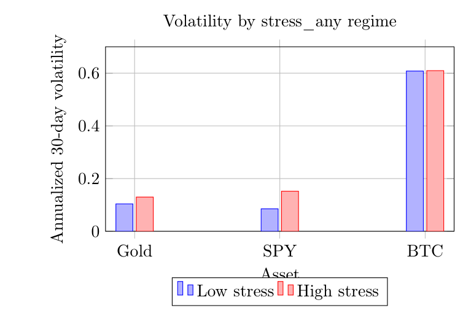
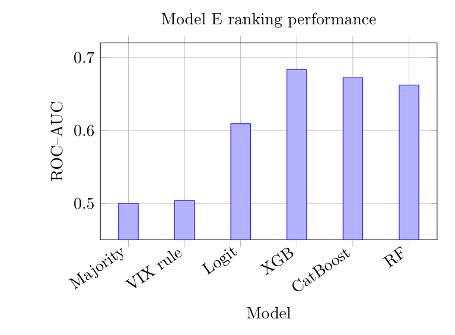
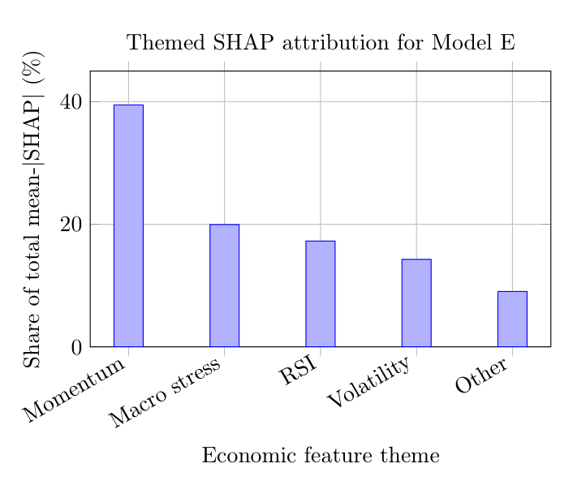

  

# Macro Stress & Asset Behavior

**When markets get stressed, does Gold actually protect you — and does Bitcoin behave anything like it?**

This is the public writeup of a CompSci 390B group research project (Nathan Dennis, Dhruv Kartik, Sebastian Vaskes Pimentel, Spring 2026). The short answer: Gold is a *conditional* safe haven — strongest in volatility-driven stress and the COVID crash, not a universal crisis asset — and Bitcoin fails the same tests, behaving more like a high-beta risk asset when it matters most.

---

## What we wanted to know

Four questions drove the project:

1. **Stress and volatility.** Are volatility and market-risk measures systematically higher during macro-financial stress?
2. **Gold as a safe haven.** Does Gold behave defensively relative to SPY during stress — and is the result robust to how you define "stress"?
3. **Bitcoin comparison.** Does Bitcoin behave like Gold under the same stress definitions, or like a high-beta risk asset?
4. **Predictive modeling.** Can lagged macro-financial indicators and market-state variables improve forecasting beyond simple baselines?

The framing matters: a safe haven isn't an asset with a good average return. It's an asset that defends *exactly when* risky assets are under pressure. So the whole project is built around stress-conditioned tests rather than full-sample averages.

## Data

We used the Kaggle dataset *Algorithmic Trading, Macro Stress, and Asset Regimes* — **4,150 daily observations from 2014-10-17 through 2026-02-25**.

- **Assets:** Gold, U.S. equities (`Equities_US`, used as SPY), Bitcoin — transformed to daily log returns.
- **Macro-financial variables:** volatility index (VIX), high-yield spread, financial stress index, yield-curve spread, 90-day stock–bond correlation, SPY drawdown, RSI features, and 30-day rolling volatility measures.

## Stress regimes

Stress is defined from high quantiles of three proxies, at a baseline 66th-percentile threshold:

| Regime | Rule | Share of days |
|---|---|---|
| `stress_hys` | High-yield spread ≥ 4.400 | 34.2% |
| `stress_fsi` | Financial stress index ≥ −0.172 | 34.1% |
| `stress_vix` | VIX ≥ 19.060 | 34.0% |
| `stress_any` | At least one flag high | 56.3% |
| `stress_all` | All three flags high | 14.3% |

The composite regimes exist so no conclusion rests on a single proxy. Threshold robustness was re-checked at the 75th and 90th percentiles — the VIX-based result survives all three; the `stress_any` result does not survive the 90th.

## Modeling

Three supervised tasks, all on **chronological splits with no shuffling** (targets shifted forward before splitting, so every task uses only time-*t* information):

- **Model E** — will Gold beat SPY tomorrow? Majority baseline, VIX rule, class-balanced Logistic Regression, XGBoost, LightGBM, CatBoost, Random Forest, MLP, and a stacking ensemble, on a 55-predictor feature matrix.
- **Model F** — 30-day rolling volatility forecasts for SPY, Bitcoin, and VIX at horizons *h* = 1 and *h* = 5: persistence vs. Ridge vs. XGBoost.
- **Model G** — stress five trading days ahead, with imbalance-aware evaluation (class weighting, SMOTE, threshold tuning), PR–AUC as the headline metric.

## What surprised us

This is the part of the project worth reading.

**Gold's safe-haven status is real but conditional.** Under VIX stress, Gold's mean daily log return is +0.00068 while SPY's is −0.00092 — the spread widens by 0.00247 with a bootstrap CI excluding zero. But the same test under financial-stress-index regimes shows *no* Gold advantage, and in the 2022 inflation/rate-hike window Gold lost more than SPY. "Gold protects you" is true for volatility-driven stress and wrong as a blanket statement.

**Bitcoin is not digital gold in this sample.** Gold's beta to SPY *falls* from +0.157 in calm periods to +0.020 during stress — the decoupling you want. Bitcoin's moves the opposite way: +0.666 calm → +0.862 stressed. Bitcoin's 30-day volatility sits near 0.61 in *both* regimes (statistically unchanged, *p* = 0.859), and its worst days overlap SPY's worst days more than Gold's do (16.3% vs 13.5% tail overlap).

**Complex models were not automatically better.** XGBoost won the directional ranking task (ROC–AUC 0.6835 vs 0.6091 for Logistic and 0.5040 for a VIX rule) — but for slow-moving volatility targets, persistence and Ridge beat XGBoost on nearly every target-horizon pair, and XGBoost collapsed to *negative* out-of-sample R² on 5-day VIX. Model complexity has to match the target.

**The MLP failed in an instructive way.** It hit ~100% training accuracy and ~53% test accuracy — a 47-point generalization gap. Seven of its top ten SHAP-ranked features fail a Kolmogorov–Smirnov train/test distribution test (*p* < 0.01). So the failure wasn't just overfitting; it was **covariate shift** — the feature distributions themselves drifted between the training window and the 2023–2026 test window. Heavier regularization fixed the calibration (Brier 0.44 → 0.24) but not the ranking (ROC–AUC stayed ≈ 0.51).

**The classifier isn't a stress indicator in disguise.** Themed SHAP attribution shows cross-asset momentum carries 39.5% of the signal, macro-stress variables 20.0%, RSI 17.3%, volatility levels 14.3%. And on already-stressed days, the explicit stress flag matters *less* — return lags and volatility levels carry the regime information instead.

## Validation

Two guards against fooling ourselves:

- **Chronological 80/20 split** for the headline results — train 2014-11-21 → 2023-11-25, test 2023-11-26 → 2026-02-24 (822 test rows; Gold beats SPY on 38.3% of them).
- **Expanding-window walk-forward validation** for Model E: for each test year 2019–2026, train on all earlier observations, test on that year. Mean ROC–AUC **0.6571** (σ = 0.0289) across eight folds, all above 0.55 — so the 0.6835 single-split number isn't one lucky cut.

## My contribution

Group project, so the boundaries matter:

- **Dhruv Kartik** implemented the empirical pipeline: regime construction, conditional return/volatility analysis, event studies, nonlinear modeling, SHAP analysis, threshold robustness, and walk-forward validation.
- **Sebastian Vaskes Pimentel** (me) contributed to model design, training, evaluation, and the comparison across Logistic Regression, Ridge, XGBoost, LightGBM, CatBoost, Random Forest, MLP, and the stacking ensemble.
- **Nathan Dennis** led the report structure, interpretation of results, and integration of the milestones into the final document.
- All three of us collaborated on the research questions, feature choices, safe-haven interpretation, limitations, and conclusions.

## Figures

<table>
<tr>
<td width="50%"></td>
<td width="50%"></td>
</tr>
<tr>
<td><b>Stress windows.</b> Gold protects capital most clearly in the COVID crash, is weak in the 2022 inflation/rate shock, and is positive but not dominant in 2023 banking stress.</td>
<td><b>Volatility by regime.</b> Gold's volatility rises in stress but stays far below Bitcoin's and expands much less than SPY's. Bitcoin is simply always volatile.</td>
</tr>
<tr>
<td></td>
<td></td>
</tr>
<tr>
<td><b>Model E ranking.</b> Nonlinear models improve the Gold-vs-SPY ranking task; XGBoost leads by ROC–AUC.</td>
<td><b>What drives it.</b> Most of XGBoost's signal comes from lagged cross-asset returns, not the stress indicators themselves.</td>
</tr>
</table>

## Full report

The final report — *Algorithmic Prediction of Trade and Value of Monetary and Currency-Based Assets: A Final Report on Macro Stress, Safe-Haven Behavior, and Predictive Modeling* (May 2026) — is [included here](report/Macro_Asset_Volatility_Modeling.pdf). It has the full methodology, all result tables, and the reference list.

## Limitations

We took these seriously; they're part of the result:

- **Regime sensitivity.** VIX-based stress produces the robust safe-haven result; HYS and FSI stress do not. A different proxy or threshold can change the conclusion.
- **Full-sample threshold bias.** Descriptive regime thresholds use quantiles computed over the full sample — fine retrospectively, but it would leak future information in a live system. A real-time version needs rolling thresholds.
- **Non-stationarity / covariate shift.** The sample spans COVID, inflation repricing, banking stress, and a changing crypto market. Walk-forward validation helps but can't eliminate regime drift — the MLP failure is direct evidence of it.
- **Event-window selection.** We picked economically meaningful windows; different start/end dates would change cumulative returns. Algorithmic window definition is future work.
- **U.S.-centric variables and a 2014 start.** Enough for modern Bitcoin, not enough to evaluate Gold across many historical cycles. No transaction costs, spreads, taxes, or portfolio constraints.
- **Multiple testing.** Many regimes, thresholds, horizons, and models were compared. Bootstrap intervals, chronological testing, and walk-forward validation reduce the risk but don't replace a pre-registered design.

---

*Course project for CompSci 390B, UMass Amherst — group of three. This repository is a writeup: the analysis code and dataset live in the course workspace; the report and figures are published here with the group's material.*
